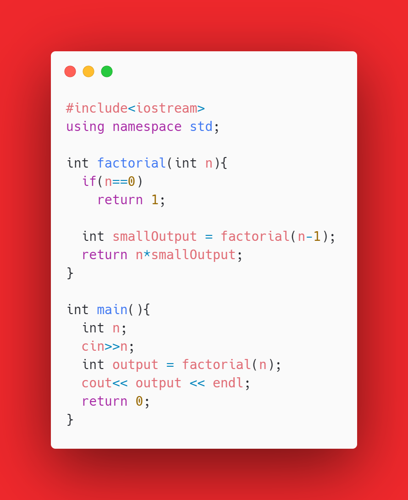

# RECURSION

### When a function is calling itself. We use it when the solution depends on the solution of a lesser number. 

##### Recursion Example 1: Factorial 
C++ Code: 

```cpp
#include<iostream>
using namespace std;

int factorial(int n){
  if(n==0)
    return 1;
  
  int smallOutput = factorial(n-1);
  return n*smallOutput; 
}

int main(){
  int n;
  cin>>n;
  int output = factorial(n);
  cout<< output << endl;
  return 0;
}
```
Downloadable Image of the code (Save this in your gallery!): 


